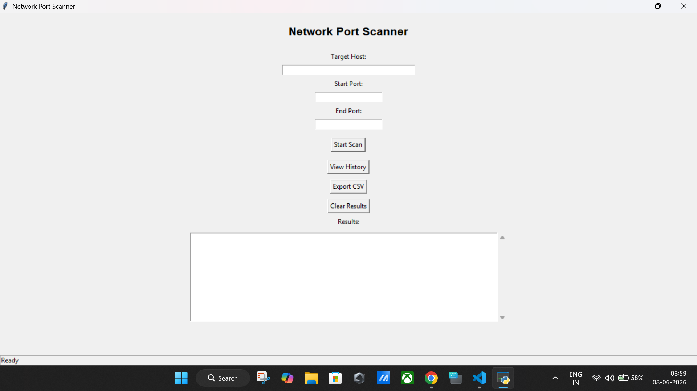
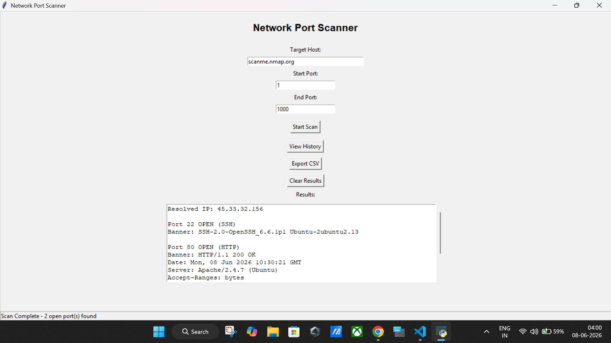
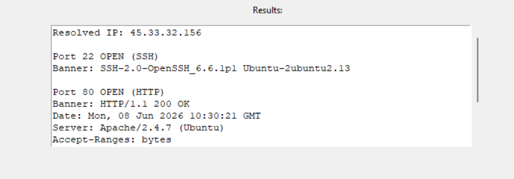
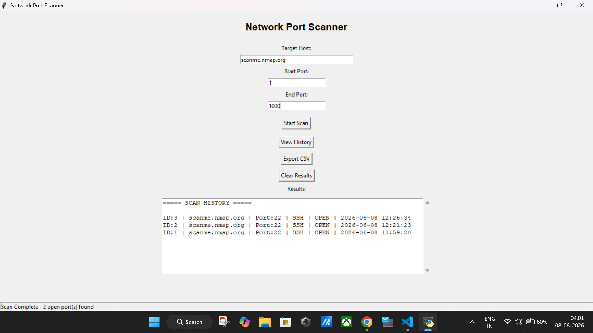

# Network Port Scanner

A Python-based Network Port Scanner with a graphical user interface (GUI) built using Tkinter. This project allows users to scan target hosts, identify open ports, detect common services, perform banner grabbing, store scan history, and export scan results.

---

## Features

- TCP Port Scanning
- Multi-threaded Scanning for Faster Results
- Hostname to IP Resolution
- Service Detection (HTTP, SSH, FTP, etc.)
- Banner Grabbing
- SQLite Database Integration
- Scan History Viewer
- CSV Export Functionality
- Logging Support
- User-Friendly Tkinter GUI
- Input Validation and Error Handling

---

## Technologies Used

- Python 3
- Tkinter
- Socket Programming
- SQLite3
- Concurrent Futures (Multithreading)
- CSV Module

---

## Project Structure

```text
Network-Port-Scanner/
│
├── screenshots/
│   ├── main_gui.png
│   ├── port_scan.png
│   ├── banner_grabbing.png
│   └── history.png
│
├── main.py
├── gui.py
├── scanner.py
├── service_detector.py
├── banner_grabber.py
├── database.py
├── logger.py
├── .gitignore
└── README.md
```

---

## Installation

### Clone Repository

```bash
git clone https://github.com/YOUR_USERNAME/Network-Port-Scanner.git
cd Network-Port-Scanner
```

### Install Requirements

No external packages are required.

Python standard libraries used:

- socket
- tkinter
- sqlite3
- csv
- concurrent.futures

---

## How to Run

Run the GUI application:

```bash
python gui.py
```

---

## Usage

1. Enter a target hostname or IP address.
2. Enter Start Port.
3. Enter End Port.
4. Click **Start Scan**.
5. View detected open ports and services.
6. Review banners returned by services.
7. Export results to CSV if required.
8. View previous scan history.

---

## Screenshots

### Main GUI



### Port Scan Result



### Banner Grabbing



### Scan History



---

## Example Output

```text
Resolved IP: 45.33.32.156

Port 22 OPEN (SSH)
Banner: SSH-2.0-OpenSSH

Port 80 OPEN (HTTP)
Banner: HTTP/1.1 200 OK
```

---

## Learning Outcomes

This project demonstrates:

- Network Programming
- TCP Socket Communication
- Port Scanning Techniques
- Banner Grabbing
- Service Enumeration
- Database Integration
- GUI Development
- Multithreading
- File Export Operations

---

## Disclaimer

This project is intended for educational and authorized security testing purposes only. Always obtain proper permission before scanning any network or system.

---

## Author

MCA Cyber Security Student

Python • Networking • Cyber Security